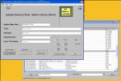



## Media Library Disk/Memory Sample \(using Binary Search Tree Node Class as database engine\)

### Description

(NEW UPDATE May 21/05) A unique Media Disk/Memory Library application sample with DISK BASED LIBRARY ACCESS as well as MEMORY LIBRARY ACCESS. It can be used to store, maintain and review CDs,DVDs,Books in a Media Disk/Memory Library by barcode or unique media key. It's unique in that it is using a Binary Search Tree Nodes Class (UPDATED since an earlier article here @psc) to allow optional DISK based BS Trees as well as the established previous existing in MEMORY version). This is a self-contained binary tree class along with a non-gui listbox class to create, search and maintain any unique key data in a binary tree. A lot of databases use this methodology as the basis for their database engines. It's an effective and very fast searching/database storage methodology. For example, a search of 3,000 keys will only require an average of 7-11 tree visits/seeks per key search. BSTN class member routines include, the output all the data keys in tree in alpha order or even in reverse alpha order. This has been extensively tested in MEMORY MODE for reliabilty and fast response for searching, insertions, deletions and traversals of tree nodes in general. Included root node release, tree re-balancing and garbage threshold detection and beta level collection. This version has an updated BSTN Class (see other psc article) DISK ACCESS wrapper to overload the BSTN member functions/properties to allow direct access to a disk based node tree around the sample media library - sample included in this article. NOTE: The DISK ACCESS mode has NOT been extensively tested as yet (look out for release late May 2005), but the project was fit to publish. If you don't need the DISK ACCESS mode, it won't be turned on unless you choose to enable it but all the MEMORY functions will work as expected. You may be surprised to learn there is little emphasis on recursion so no worries of runaway stack levels. GARBAGE COLLECTION UPDATED under menu tools options. see Help How-To. (c) David K Richmond
 
### More Info
 
sample data files included

principles of Binary Search Trees helpful, but not essential. Try google.com .. search for binary trees. There several good examples of the methodology.

writes to application path is save used, or disk access mode used.

             |
---                |---
**Submitted On**   |2005-05-17 05:05:22
**By**             |[David K Richmond](https://github.com/Planet-Source-Code/PSCIndex/blob/master/ByAuthor/david-k-richmond.md)
**Level**          |Beginner
**User Rating**    |5.0 (65 globes from 13 users)
**Compatibility**  |VB 6\.0
**Category**       |[Databases/ Data Access/ DAO/ ADO](https://github.com/Planet-Source-Code/PSCIndex/blob/master/ByCategory/databases-data-access-dao-ado__1-6.md)
**World**          |[Visual Basic](https://github.com/Planet-Source-Code/PSCIndex/blob/master/ByWorld/visual-basic.md)
**Archive File**   |[Media\_Libr1890305212005\.zip](https://github.com/Planet-Source-Code/david-k-richmond-media-library-disk-memory-sample-using-binary-search-tree-node-class-as-d__1-60524/archive/master.zip)

